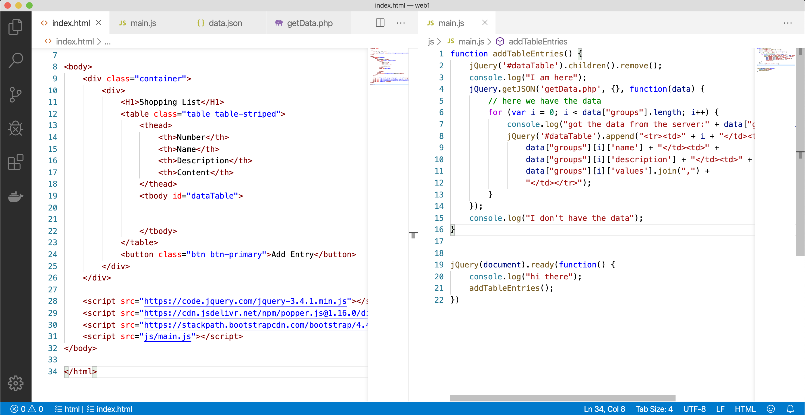

# Geodesic distances in white matter
## Curvilinear coordinates in human white matter

\lettrine[lines=4]{\color{Black}T}{} his module creates curvilinear coordinates from volumetric label fields. 
    It simulates the heat equation and exports the temperature (potential) field and the 
    gradient of the potential field (tangent unit vector). The gradient field represents the 
    directions of geodesic lines connecting the fixed temperature regions.
    
    This module can be used to compute the shorted path between points of the ventricles 
    and points of the white/gray matter border using structural information (white matter) 
    only. It can also be used to sample the white matter at a given distance perpendicular to 
    the gray/white matter border.
    

<dl>
  <dt>Tags</dt>
  <dd>Programming, Software</dd>
  <dt>Creator</dt>
  <dd>Hauke Bartsch, Dr. rer. nat.</dd>
  <dt>Place</dt>
  <dd>https://github.com/mmiv-center/LungSegmentation.git</dd>
  <dt>Date</dt>
  <dd>2020-01-13</dd>
  <dt>Audience</dt>
  <dd>World</dd>
</dl>
